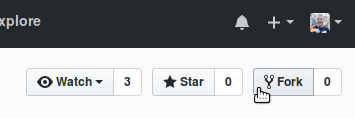
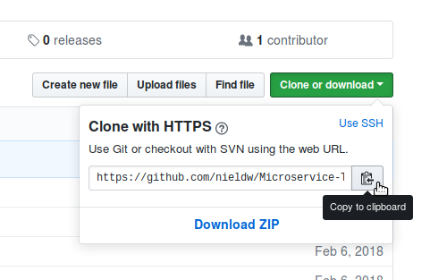

# Microservice-Tutorial
_Java-based microservices, JHipster, and Kubernetes_

The purpose of this tutorial is to introduce you to the basic concepts of a Java-based microservices architecture. 
We will demonstrate using [JHipster](http://jhipster.tech/) to generate services, using [Docker](https://www.docker.com)
for containers and [Kubernetes](http://kubernetes.io/) for container orchestration.

## Getting started
### Install all of the following tools

- Linux - _choose your own poison_
- IntelliJ Idea - _Ultimate_ has great support for this tutorial
- JDK 8+ - _[SDKMAN](http://sdkman.io/) is a great tool for managing development tools for the JVM_
- [Docker](https://www.docker.com/community-edition)
- [kubectl + Minikube](https://kubernetes.io/docs/tasks/tools/install-minikube/)
- [NodeJS + NPM](https://docs.npmjs.com/getting-started/installing-node)
- Git

#### Hello Minikube
To familiarise yourself with Minikube first, you can work through the 
[Hello Minikube](https://kubernetes.io/docs/tutorials/stateless-application/hello-minikube/) tutorial.

### Fork this repo
Start by forking this repo. This will create a copy of this repo in your own Github account.

### Clone your fork
Next, clone your fork using the URL of your own repo.

Using your terminal, run:

    git clone <repo URL>
    
For example:

    git clone https://github.com/<username>/Microservice-Tutorial.git
    
### Install JHipster

Install yarn:

    npm install -g yarn
    
Install JHipster:
    
    yarn global add jhipster@4.14.0

Add binaries installed by yarn to your PATH:

    echo 'export PATH="$PATH:`yarn global bin`:$HOME/.config/yarn/global/node_modules/.bin"' >> ~/.bashrc
    source ~/.bashrc

Test your installation:

    jhipster --version
    
    > Using JHipster version installed globally
    > 4.14.0
    
## Presentations
The presentations, covering some basic theory behind this tutorial, can be found [here](slides/README.md).

## Practical
Let's get our hands dirty!

1. [Run and interact with your first microservice - User Authorization and Authentication](microservices/uaa/instructions.md)
1. [Generate an API-Gateway, service registry and monitoring console](microservices/api-gateway/instructions.md)
1. [Configure ingress to your application](microservices/ingress/instructions.md)
1. [Set up an example service that will interact with other microservices to fulfill requests](microservices/example-app/instructions.md)
